# Watchlist Homework
## working enviroment
- windows 11
- terminal: powershell
- anaconda environment
- flask

## 初始化数据库
- 先利用SQL语言建立数据库，再将其转为SQLlite方式
- 建立本地的数据库 `movie.db`.将程序直接连接该数据库

## 网页建立
-参考flask-tutorial教材搭建网页、实现与本地数据库的连接、建立表单并实现了用户的登录、登出，在不同页面间的跳转
-在此基础上，又建立了actor页面记录演员信息
-在使用书中给定的数据库的基础上通过了全部测试

## 网页展示

### 未登录状态
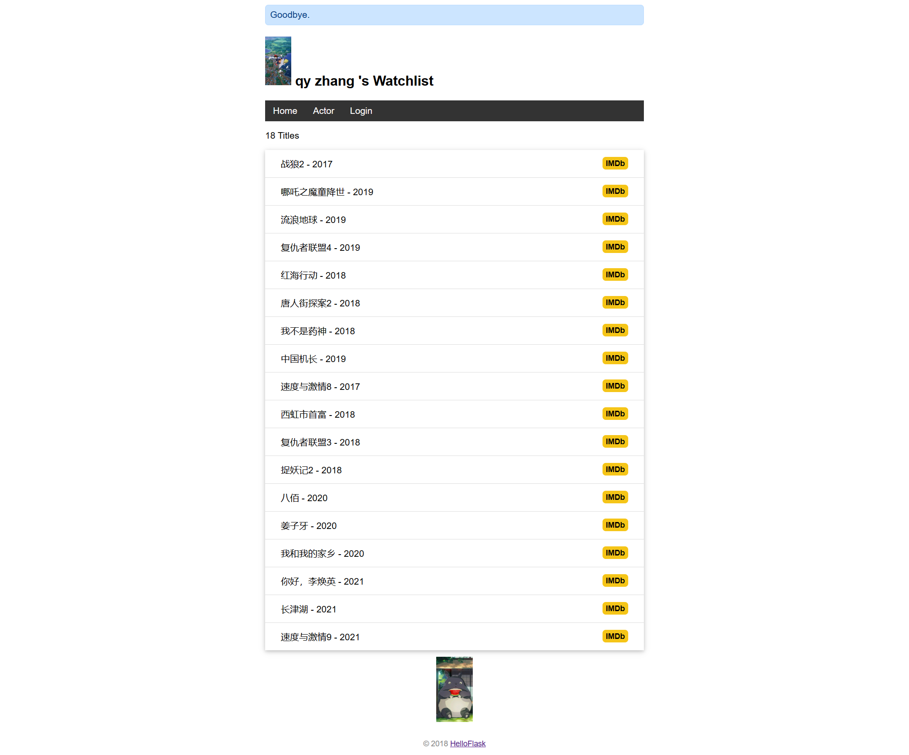

### 登录界面
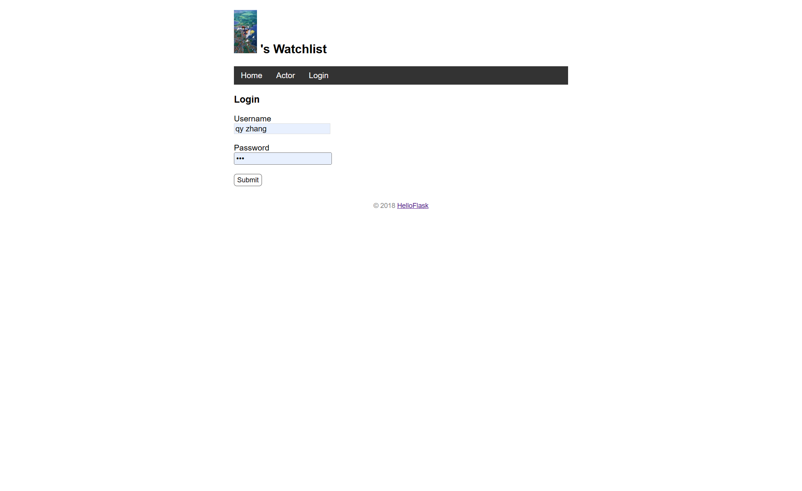

### 登录后状态
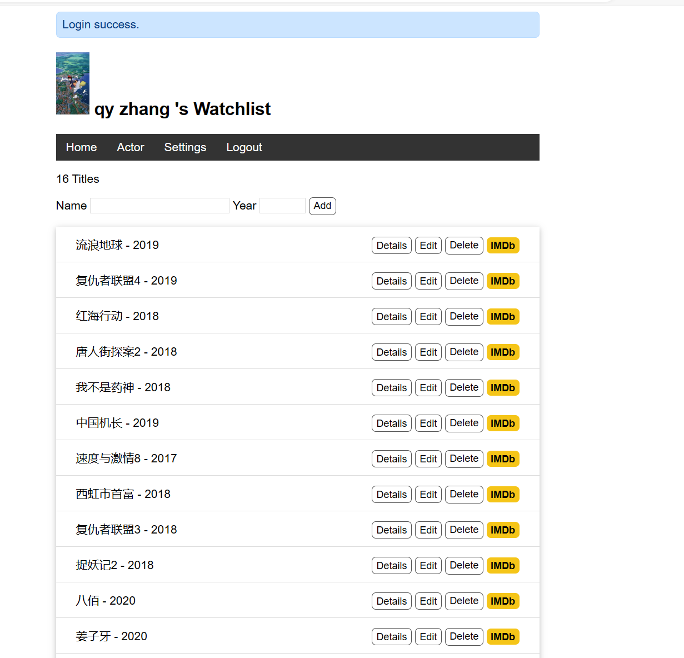

### 演员界面
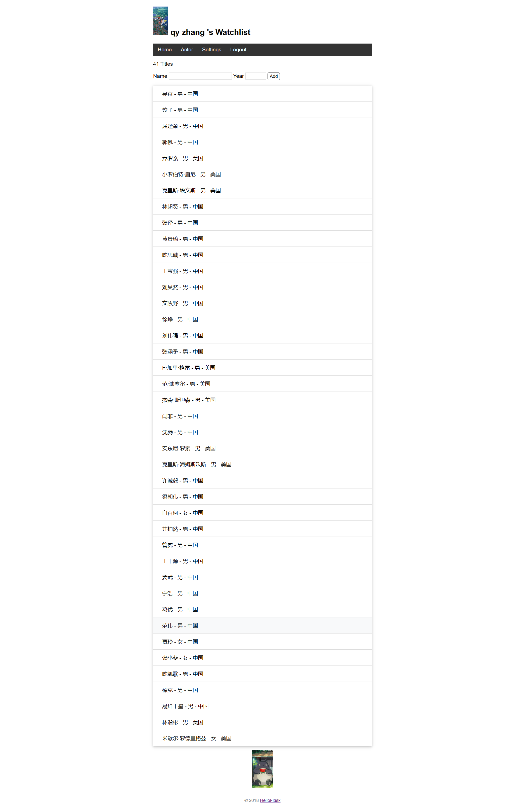

### 编辑界面
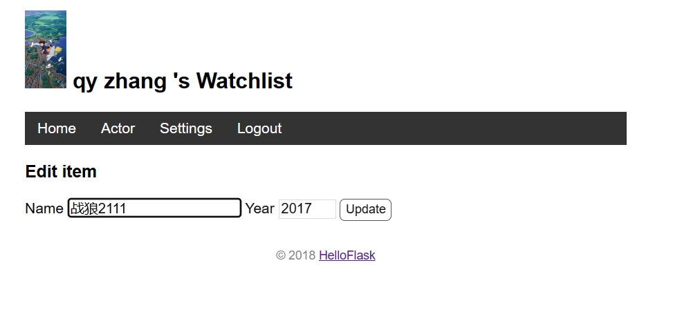
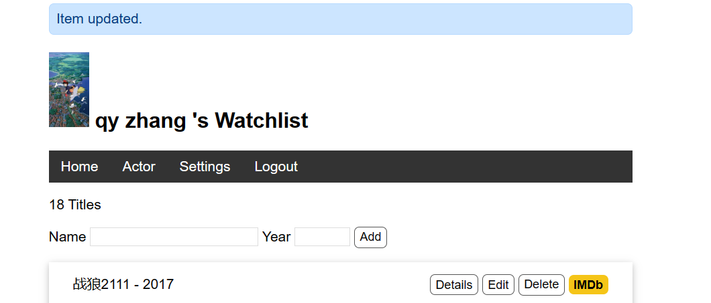

### 删除操作
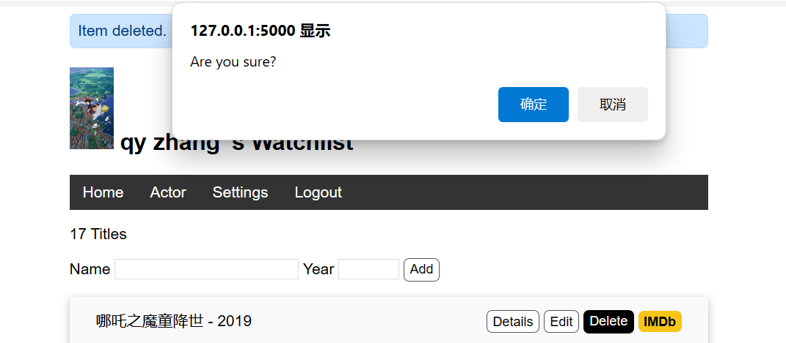
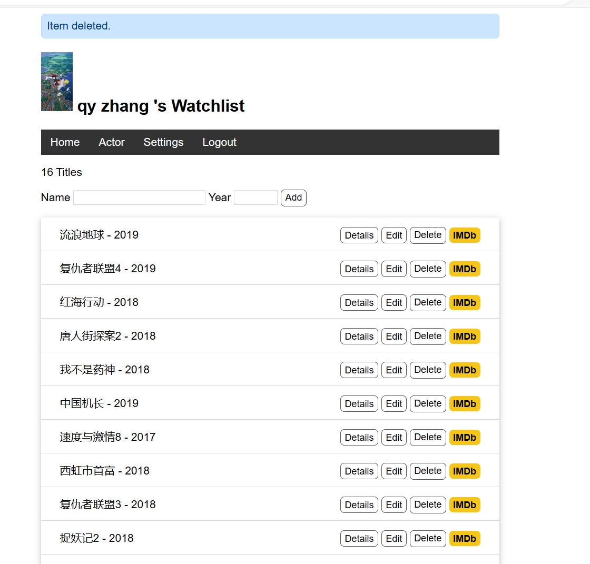

### 新增内容功能
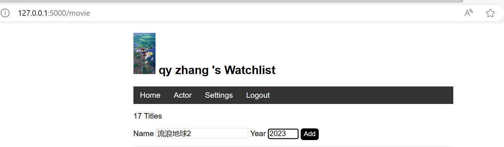
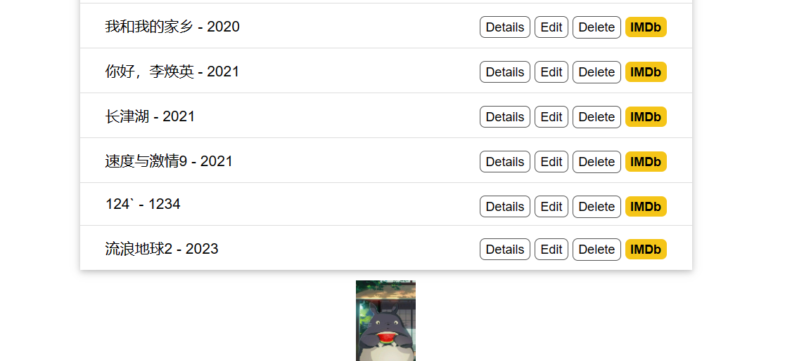

同理，也可以新增演员
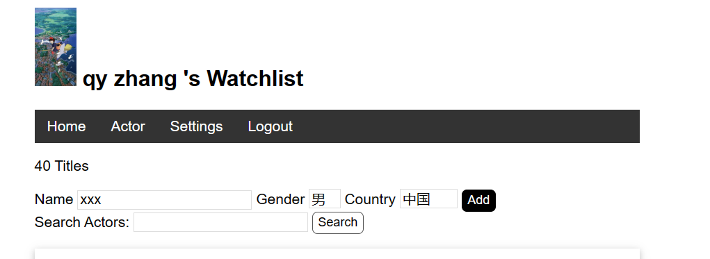
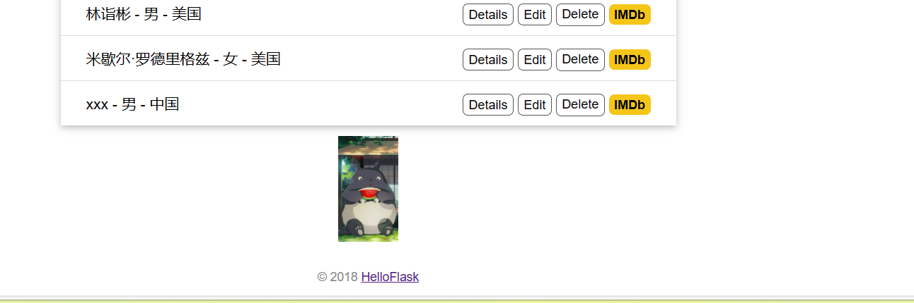
## 电影详情界面
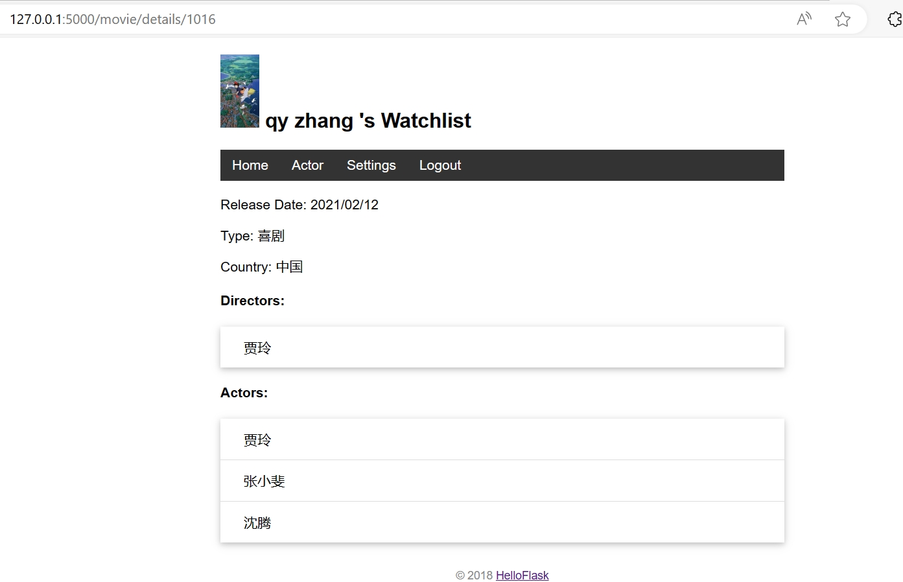

## 演员详情界面
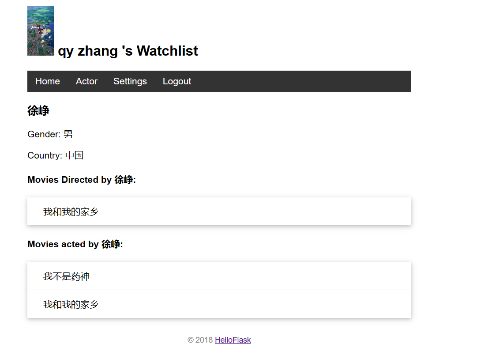

## 搜索功能
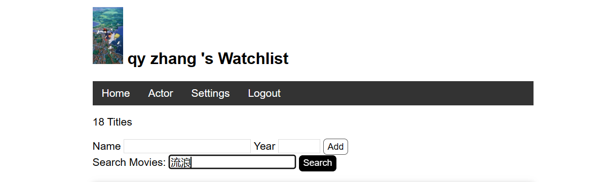
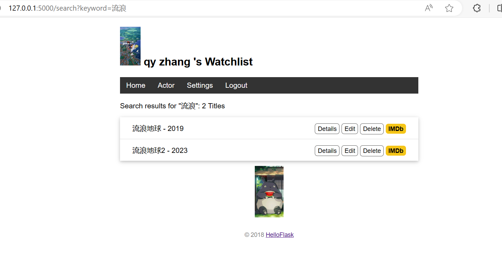
同理，也可以搜索演员
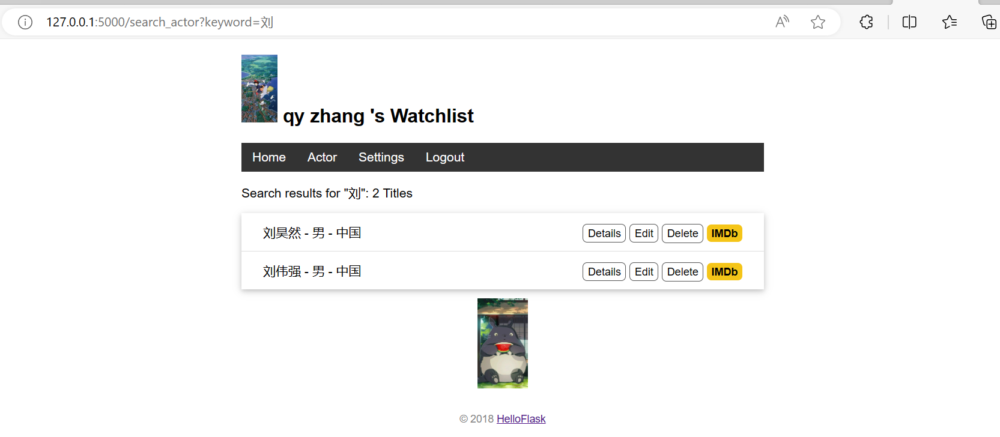
### 设置状态


## Installation:
- download [python windows](https://www.python.org/ftp/python/3.12.0/python-3.12.0-amd64.exe) then install. `Add Python to environment variables`, open powershell and input `python --version` to check.
- enviroment setup:
```bash
# open pwoershell as admin
Set-ExecutionPolicy RemoteSigned
mkdir watchlist
cd watchlist
python -m venv env
env\Scripts\activate
pip install flask flask_sqlalchemy
# output: (env) PS D:\code\flask-mysql\watchlist>
```

# notes
## push my change to [github](https://github.com/2021201554zqy/RucMovie)
```bash
git add .
git commit -m "my message"
git push
```